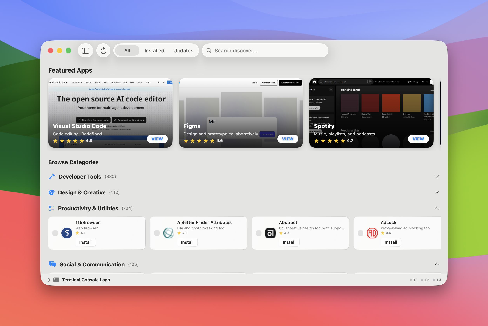

# BrewDeck

BrewDeck is a beautifully designed, native macOS graphical user interface for Homebrew. It allows you to effortlessly discover, install, update, and manage your Homebrew packages (both Casks and Formulae) with a premium aesthetic that perfectly matches the modern macOS design language.



## Features

- **Discover & Browse**: Explore thousands of Homebrew packages categorized neatly (Developer Tools, Productivity, Creative, etc.) using smooth, horizontally-scrolling shelves, featuring **Featured Apps** and **AI Recommendations**.
- **Ask AI**: Get instant insights about any package using your choice of AI backend, including **Apple Intelligence**, **OpenRouter**, **Gemini**, or local **Ollama** models.
- **Native SwiftUI Design**: Built entirely with SwiftUI, featuring stunning **Liquid Glass** elements, smooth animations, and a responsive layout that feels right at home on your Mac.
- **Bulk Operations**: Select multiple packages and install, update, or remove them all at once with integrated **Touch ID** authentication for tasks requiring elevated privileges.
- **Category Management**: Organize your experience by hiding categories you don't use.
- **Live Terminal Console**: A multi-threaded slide-up console drawer lets you watch exactly what Homebrew is doing under the hood in real-time across multiple concurrent operations.
- **Zero Dependencies**: BrewDeck compiles into a single native macOS App bundle. No Electron, no web views—just pure native performance.

## Prerequisites

- macOS 14.0 (Sonoma) or later
- [Homebrew](https://brew.sh/) installed on your system
- Swift compiler and command-line tools (included with Xcode or Xcode Command Line Tools)

## Installation & Building

Since BrewDeck is built to be as lightweight and independent as possible, it does not use an Xcode project file. Instead, it compiles directly from the Swift source into a native macOS Application bundle using a custom bash build script.

1. Clone the repository:
   ```bash
   git clone https://github.com/yourusername/BrewDeck.git
   cd BrewDeck
   ```

2. Run the build script:
   ```bash
   chmod +x build.sh
   ./build.sh
   ```

3. (Optional) Clear extended attributes if you encounter "App is damaged" errors:
   ```bash
   xattr -cr BrewDeck.app
   ```

4. Launch the app! The script automatically packages the compiled executable into `BrewDeck.app` inside the project directory. You can drag this to your `/Applications` folder or open it directly:
   ```bash
   open BrewDeck.app
   ```

## Folder Structure

- `Sources/` - Contains the native SwiftUI source code (`BrewDeck.swift`).
- `Assets/` - Contains visual assets like banners, icons (`AppIcon.png`), and screenshots used in the app.
- `ModuleCache/` - Local module cache for faster compilation.
- `build.sh` - The shell script that compiles the source code using `swiftc` and constructs the `.app` bundle structure with the necessary `Info.plist`.

## Contributing

Contributions are always welcome! Feel free to open issues or submit pull requests. If you are adding new features, please ensure they follow the Liquid Glass design aesthetic and do not introduce unnecessary dependencies.

## License

This project is licensed under the MIT License - see the [LICENSE](LICENSE) file for details.
